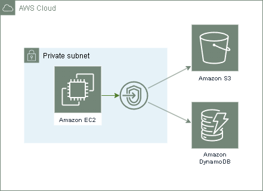
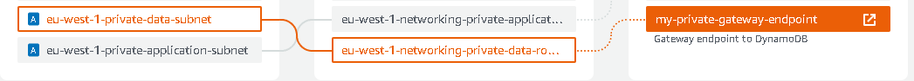
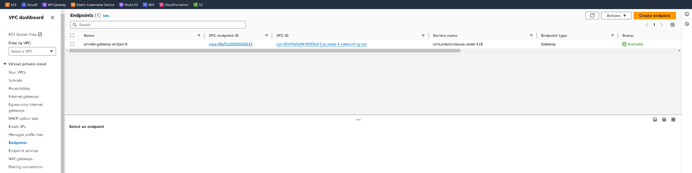
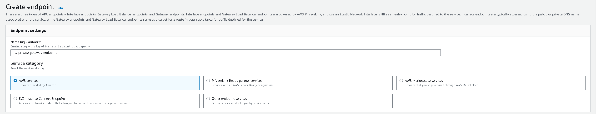
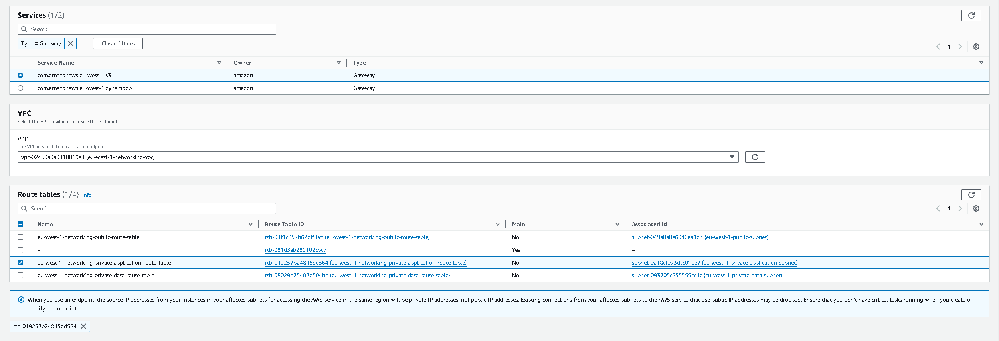
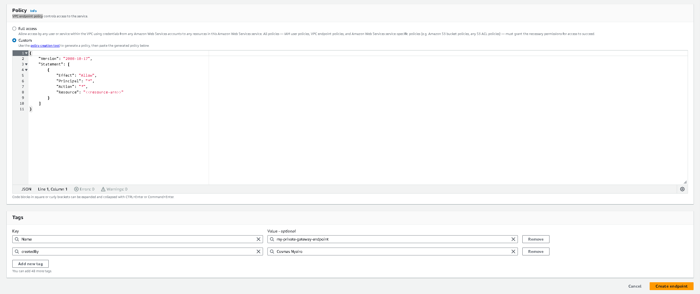
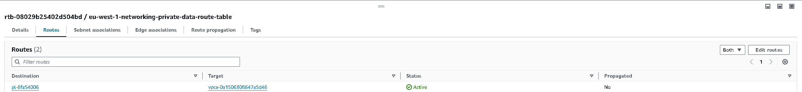

# Networking

A short writeup of networking on aws.

## Table of Contents
 - [Notes](#notes)
 - [Gateway VPC Endpoints](#gateway-vpc-endpoints)
    - [Example](#gateway-vpc-endpoints-example)

## Notes
  - Architecture images for all entries in: [architecture-images](architecture-images/)

## Gateway VPC Endpoints
For our services, if we want to have internet access, we route the traffic via an internet gateway. 

However, there may be cases where we we don't want our network traffic to go through the public internet, we could utilise vpc endpoints, with vpc endpoints, we are able to access aws services via a private network.

A gateway vpc endpoint targets ip routes in a prefix list that belong to an aws service. Supported services are:
>> 
    - AWS S3
    - DynamoDB

Below architecture diagram of a gateway vpc endpoint showcases the implementation:
  

### Gateway VPC Endpoints Example:

- Guide to creating a gateway vpc endpoint.
    

- Step 1: On the vpc dashboard click on the endpoints tab, then create endpoint button on the right.
     
   
- Step 2: Choose the name of the endpoint being created, For this demo, we use the aws services category, 
    
- Step 3:
  - Use the filter: `Type = Gateway` for us to create a gateway vpc endpoint.
  - Choose the service name type to be created.
  - Choose your private vpc and which route table for the prefix list entries to be added to.
    
- Step 4:
  - Choose the VPC endpoint policy to be used when accessing the resources. 
  - Tag your resources for effective cost tracking.
    
- Our route table will have new entries added with the prefix list of the service we're connecting to:
    
